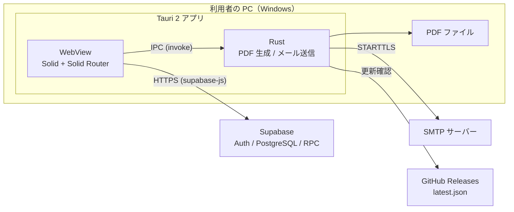
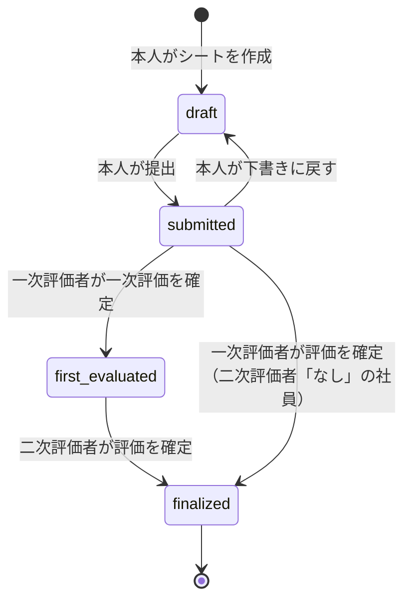
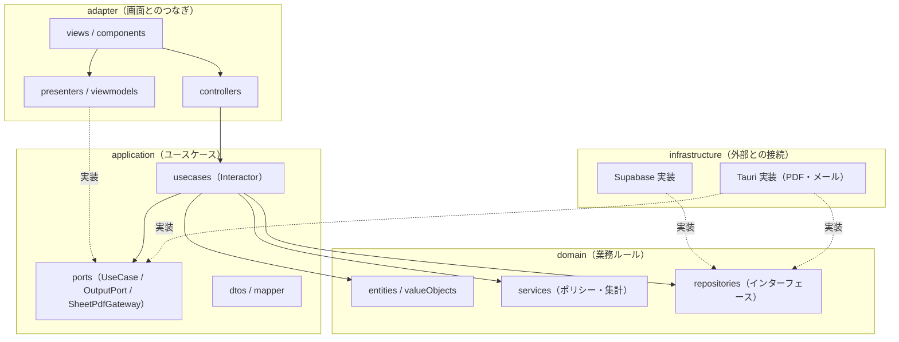
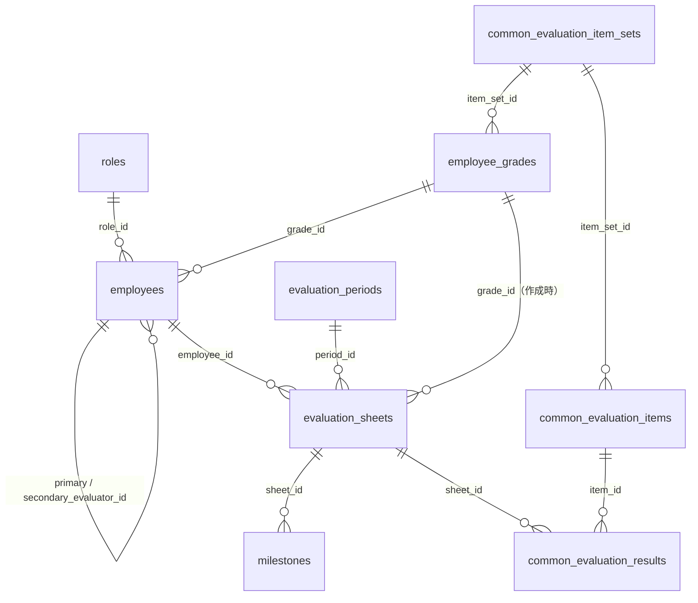
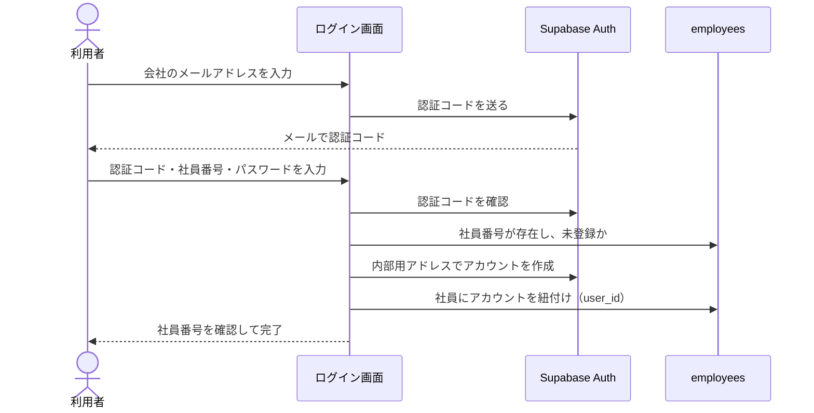

# TYPA 基本設計書

| 項目 | 内容 |
| --- | --- |
| 対象 | typa 0.9.2（コミット `6e82765`）に、14 章で挙げていた食い違いの解消を加えた時点 |
| 作成日 | 2026-10-08 |
| 作成方法 | 実装（`src/`、`src-tauri/`、`supabase/migrations/`）とテストからのリバースエンジニアリング |

本書は、実装とテストから読み取った「いま動いている仕様」をまとめたものです。利用者向けの操作説明はアプリ内のヘルプ（`/help`）が担い、本書は保守・改修する人が全体像と判断の根拠をつかむためのものです。

本書と実装が食い違う場合は、実装とテストを正とします。実装同士の食い違いなど、読み取りの途中で気づいた点は [14. 実装から読み取れた注意点](#14-実装から読み取れた注意点) にまとめています。未解決のセキュリティ課題は [12.3](#123-残っている課題) にまとめています。

## 目次

1. [システム概要](#1-システム概要)
2. [用語](#2-用語)
3. [評価の進行（状態遷移）](#3-評価の進行状態遷移)
4. [権限設計](#4-権限設計)
5. [評価点とランクの計算](#5-評価点とランクの計算)
6. [画面設計](#6-画面設計)
7. [アーキテクチャ](#7-アーキテクチャ)
8. [データ設計](#8-データ設計)
9. [認証とアカウント登録](#9-認証とアカウント登録)
10. [通知メール](#10-通知メール)
11. [PDF 帳票](#11-pdf-帳票)
12. [セキュリティ設計](#12-セキュリティ設計)
13. [テスト設計とビルド・配布](#13-テスト設計とビルド配布)
14. [実装から読み取れた注意点](#14-実装から読み取れた注意点)

---

## 1. システム概要

### 1.1 目的

人事考課の評価シートを、被評価者本人の記入から一次評価、二次評価、確定、PDF 出力まで一つのデスクトップアプリで進めます。最終成果物は、確定した評価シートの PDF です。

### 1.2 利用者

| 利用者 | 行うこと |
| --- | --- |
| 被評価者（本人） | 自分の評価シートを作成し、チャレンジ目標と達成状況を記入して提出する |
| 一次評価者 | 提出されたシートを評価し、一次評価を確定する |
| 二次評価者 | 一次評価が確定したシートを評価し、評価を確定する |
| 管理担当者（Admin） | 評価期間、社員の権限・等級・評価者、評価点の配点を管理し、登録の取り消しを行う。全社員の評価シートの一覧を見て、PDF に出力する |

一人の社員が、自分のシートでは被評価者、部下のシートでは評価者になります。役割はシートごとに決まります（[4.2](#42-シート上の役割と操作)）。

### 1.3 システム構成



| 要素 | 技術 | 役割 |
| --- | --- | --- |
| 画面 | Solid 1.9、@solidjs/router、lucide-solid | 画面表示と操作 |
| デスクトップ | Tauri 2（Rust） | ウィンドウ、保存ダイアログ、自動更新、PDF 生成、メール送信 |
| データ・認証 | Supabase（Auth、PostgreSQL、RPC） | 社員・評価データの保存、ログイン |
| 帳票 | Typst（typst-as-lib、typst-pdf） | 評価シート PDF の組版 |
| メール | lettre（SMTP、STARTTLS） | 評価者への通知 |
| ビルド・検査 | Vite 8、TypeScript 7、Biome、Vitest 5、PGlite | ビルド、型検査、整形、テスト |

業務ロジックを持つサーバーはありません。画面が Supabase のテーブルと DB 関数（RPC）を直接呼びます。このため、認可はアプリ側のポリシーと DB 側の制約の両方で成り立ちます（[12](#12-セキュリティ設計)）。

---

## 2. 用語

| 用語 | 意味 |
| --- | --- |
| 評価シート | 社員一人・評価期間一つにつき1枚。チャレンジ目標、共通評価、総評、集計を持つ |
| 評価期間 | 評価の対象期間（`evaluation_periods`）。期間名・開始日・終了日を持つ。実施中の期間は常に1つ |
| 期間締め | 次の評価期間を開始し、それまで実施中だった期間を同時に締める操作。締めた期間のシートは変更できない |
| チャレンジ目標 | 本人が立てる目標。1シートにつき最低1件、最大4件。タブの追加・削除で件数を変更する。空欄（空白のみも含む）のあるタブが残っている場合は提出・確定できず、エラーダイアログで入力またはタブの削除を求める。チャレンジ目標・中間目標・達成状況を本人が記入する。コード上は Milestone / objective |
| 共通評価 | 等級ごとに決まった評価項目による評価。本人は記入も閲覧もしない |
| 項目セット | 共通評価の項目のまとまり。同じ項目で評価する等級は同じセットを指す |
| 一次評価・二次評価 | 一次評価者・二次評価者がそれぞれ付ける点数と総評 |
| 最終評価 | 評価点とランクを決める評価。通常は二次評価。二次評価者「なし」の社員は一次評価 |
| 最終評価者 | 評価を確定する人。通常は二次評価者。二次評価者「なし」の社員は一次評価者 |
| 二次評価者「なし」 | 二次評価者を置かないと明示した状態（`no_secondary_evaluator = true`）。単に決まっていない「未設定」とは区別する |
| シートの評価者 | そのシートを評価する一次・二次評価者。シートが持ち、評価が確定した後は社員マスタで付け替えても変わらない |
| 評価点 | 100点満点の点数。チャレンジ目標と共通評価の得点率に、それぞれの配点を掛けた合計 |
| 配点 | 100点をチャレンジ目標と共通評価にどう割り振るか。Admin が設定する。既定は 20 / 80 |
| 評価ランク | 評価点の得点率から機械的に決まる S・A・B+・B・B-・C・D |
| 権限 | アプリの管理機能に対する Admin / Reviewer / Employee。シート上の役割とは別のもの |

---

## 3. 評価の進行（状態遷移）

評価シートの状態は4つで、`EvaluationStatus`（[src/domain/valueObjects/EvaluationStatus.ts](../src/domain/valueObjects/EvaluationStatus.ts)）が持ちます。DB には文字列で保存します。



| 状態 | 表示名 | 誰の番か | 備考 |
| --- | --- | --- | --- |
| `draft` | 下書き | 本人 | 評価者には内容を見せない |
| `submitted` | 一次評価待ち | 一次評価者 | 本人は下書きに戻せる |
| `first_evaluated` | 二次評価待ち | 二次評価者 | 一次評価は変更できない。本人も戻せない |
| `finalized` | 最終評価済み | なし | 誰も変更できない。本人と評価者は PDF を出力できる |

表示名は「いま何を待っているか」で付けています。本書の説明では、状態そのものを指すときに「提出済み」「一次評価済み」「評価確定」と呼びます。一覧では、状態ごとに色とアイコン（下書き: 鉛筆 / 一次評価待ち: 紙飛行機 / 二次評価待ち: 砂時計 / 最終評価済み: 認証バッジ）を付け、色だけに頼らず見分けられるようにしています。

状態を進めるときの規則は次のとおりです（`UpdateEvaluationStatusInteractor`）。

- **確定には、確定する本人の評価がすべて入っていること。** 一次評価の確定は一次評価の、評価の確定は二次評価（二次評価者「なし」の社員は一次評価）の、チャレンジ目標と共通評価の全項目が 1〜4 であること。0 は未評価として扱い、不足している項目を一覧で返す。相手の評価者の入力は要求しない。同じ検査を DB のトリガー `check_evaluation_completion` でも行う。
- **二次評価者が「未設定」の社員は確定できない。** 設定漏れで一次評価者が最終評価者にならないよう、「なし」と明示した社員だけが一次評価の確定で完了する。
- **確定した時点の値を保存する。** 一次評価の確定時に一次評価ランクを、評価の確定時に最終評価ランク・集計値・評価点・配点を保存する。以後は保存値を使い、配点の変更や評価者の付け替えに左右されない（[5.5](#55-確定した値の固定)）。
- **通知の失敗で確定は取り消さない。** 状態を保存した後にメールを送り、送信の結果は宛先ごとにトーストで知らせる。通知を送るかどうかは、確定の確認ダイアログで選べる（[10](#10-通知メール)）。

### 3.1 評価期間と期間締め

評価シートは、ある評価期間・ある社員につき1枚です。期間の管理は Admin が設定画面で行います。

- **実施中の評価期間は常に1つ。** 評価シートの作成・記入・評価・状態の変更ができるのは、実施中の期間のシートだけ。締めた期間のシートは、閲覧と PDF 出力だけになる。
- **期間締めは「次の期間を開始する」操作。** 次の期間を実施中にするのと同時に、それまで実施中だった期間を締める。片方だけを変える操作はない。
- **未確定のシートが残っていると締められない。** 締める期間に下書き・提出済み・一次評価済みのシートが1枚でもあれば拒否する。シートを作成していない社員がいることは、締める条件に含まない（確認ダイアログで注意を促す）。
- **締めた期間のシートは誰も変更できない。** アプリのポリシーに加えて DB のトリガーが、評価シート・チャレンジ目標・共通評価の結果の追加・更新・削除を拒否する。API を直接呼んでも変更できない。
- **間違えたら戻せる。** 元の期間をもう一度開始すれば元に戻る。ただし同じ条件がかかるので、その時点で実施中の期間に未確定のシートがあると戻せない。
- **追加した期間は、締めた状態で始まる。** 実施中になるのは期間締めのときだけ。期間名は重複できず、終了日は開始日以降。
- **削除できるのは、実施中でなく、評価シートが1枚もない期間だけ。** 間違えて追加した期間を消すためのもの。

---

## 4. 権限設計

権限は二つの軸に分かれます。

- **アプリの権限**（Admin / Reviewer / Employee）: 社員マスタと設定を誰が変えられるか。
- **シート上の役割**（本人 / 一次評価者 / 二次評価者）: その評価シートを誰が見て、何を編集できるか。

Admin は、全社員の評価シートを一覧で見られます（誰のシートがどの段にあり、誰が評価し、確定した結果はどうか）。一覧の PDF には、段ごとのランクと総評も載ります。ただし評価シートそのものを開けるのは、Admin であっても、そのシートの本人・評価者だけです。

### 4.1 アプリの権限

`employees.role_id` が指す `roles.role_name` で決まります。未設定や未知の名前は、いちばん弱い Employee として扱います（`EmployeeRole.fromStored`）。判定は [EmployeeMasterAccessService](../src/domain/services/EmployeeMasterAccessService.ts) に集約しています。

| 操作 | Admin | Reviewer | Employee |
| --- | :-: | :-: | :-: |
| 社員マスタで自分の情報を見る | ○ | ○ | ○ |
| 社員マスタで全社員の一覧・評価構造を見る | ○ | ○ | × |
| 全社員の一次・二次評価者を変える | ○ | ○ | × |
| 等級を変える | ○ | × | × |
| 権限を見る・変える | ○ | × | × |
| 登録を取り消す | ○ | × | × |
| 設定（配点）を変える | ○ | × | × |
| 設定（配点）を読む | ○ | ○ | ○ |
| 評価期間を追加・変更・削除する | ○ | × | × |
| 期間を締める（次の期間を開始する） | ○ | × | × |
| 全社員の評価シートの一覧を見る・PDF に出力する（PDF にはランクと総評が載る） | ○ | × | × |

- 全社員の評価シートの一覧は、アプリの判定（`canViewAllSheets`）に加えて、DB 関数 `get_sheet_overview` が Admin であることを確かめる。Admin がシートの表を直接読める範囲は広げていない。
- 権限の変更と登録の取り消しは DB 関数（`set_employee_role`、`reset_employee_registration`）が Admin であることを確かめる。配点の更新は RLS が Admin 以外を拒否する。
- 評価期間の追加・変更・削除は RLS が、期間締めは DB 関数（`activate_evaluation_period`）が、Admin であることを確かめる。実施中かどうか（`is_active`）は、クライアントから直接は書き換えられない。
- Admin を 0 人にする変更は、アプリと DB 関数の両方で拒否する。
- 自分自身の登録は取り消せない。自分自身を評価者には設定できない。
- 評価者と等級の更新は `employees` テーブルの直接更新で、アプリ側の判定のみ（DB 側の強制は SEC-002 の対象）。

### 4.2 シート上の役割と操作

役割は、シートが持つ評価者（`evaluation_sheets` の `primary_evaluator_id` / `secondary_evaluator_id`。[5.7](#57-シートの評価者)）とログイン中の社員を照らして、シートごとに決めます。判定はすべて [EvaluationSheetAccessPolicy](../src/domain/services/EvaluationSheetAccessPolicy.ts) にあり、画面・ユースケース・PDF が同じものを使います。

| 操作 | 本人 | 一次評価者 | 二次評価者 | 条件となる状態 |
| --- | :-: | :-: | :-: | --- |
| シートを見る | ○ | ○ | ○ | 評価者は提出済み以降（下書きは不可） |
| 目標の文言（チャレンジ目標・中間目標・達成状況）を編集 | ○ | × | × | 下書き |
| 提出する | ○ | × | × | 下書き |
| 下書きに戻す | ○ | × | × | 提出済み |
| 一次評価（目標の点数・共通評価の点数とコメント・一次総評）を編集 | × | ○ | × | 提出済み |
| 一次評価を確定する | × | ○ | × | 提出済み（二次評価者がいる社員） |
| 二次評価（目標の点数・共通評価の点数・二次総評）を編集 | × | × | ○ | 一次評価済み |
| 評価を確定する | × | △ | ○ | 二次評価者: 一次評価済み / △ 一次評価者: 二次評価者「なし」の社員の提出済み |
| 共通評価・一次総評・一次評価ランクを見る | × | ○ | ○ | 提出済み以降 |
| 二次評価の内容（共通評価の二次点数・二次総評）を見る | × | × | ○ | 提出済み以降 |
| 評価点・最終評価ランクを見る | × | △ | ○ | △ 二次評価者「なし」の社員の一次評価者 |
| PDF を出力する | ○ | ○ | ○ | 評価確定。内容は誰が出力しても同じ |

補足:

- 無関係の社員と未ログインは、すべて不可。シートの取得自体が「閲覧する権限がありません」で失敗する。
- 表の編集・提出・確定は、どれもシートの評価期間が実施中であることが前提。締めた期間のシートでは、役割や状態にかかわらずすべて不可になる（閲覧と PDF 出力は変わらない）。
- 二次評価者は、一次評価の確定前でも提出済みのシートを読める（評価の入力はできない）。
- データの異常で本人が自分の評価者に設定されていても、本人として扱い、自己採点・自己確定はできない。
- 一人が同じ社員の一次・二次評価者を兼ねる場合は、段階ごとにそれぞれの操作ができる。
- 画面で見られる範囲は上の表のとおり役割で変わるが、PDF は確定した評価の記録として、出力できる人には全員同じ内容を出す。本人は確定後に PDF を出力することで、共通評価・総評・評価点・評価ランクを含む自分の評価結果を確認できる。一次評価者も、確定後の PDF では二次評価の内容を確認できる。

### 4.3 見せない値の扱い

画面向けのデータでは、見られない値をユースケースが DTO を作る時点で落とします（`toEvaluationSheetDto`）。画面で隠すのではありません。

| 値の種類 | 見られない人への返し方 |
| --- | --- |
| 点数・集計・得点率・評価点 | `null` |
| 総評 | 空文字 |
| 評価ランク | 項目ごと省略 |

評価者向けの一覧（`get_reviewer_workspace`）は DB 関数の中で同じ絞り込みを行い、一次評価者には二次評価の値を返しません。評価シート一覧の旧項目 `totalScore` は、誰に対しても `null` です。Admin 向けの全社の一覧（`get_sheet_overview`）が持つのは、期間・社員・作成時の等級・状態・評価者・更新日時、確定したランク（一次評価ランク・最終評価ランク）と評価点、一次・二次の総評です。このうち一次評価ランクと総評は一覧の PDF にだけ載せ、画面の一覧には渡しません（`FetchSheetOverviewInteractor` が DTO に入れない）。

---

## 5. 評価点とランクの計算

計算はドメイン層の値オブジェクト（`Score`、`EvaluationScoreTotals`、`EvaluationAllocation`、`EvaluationAllocatedScores`、`EvaluationRank`）にあり、画面・評価者向け一覧・PDF が同じ結果になります。

### 5.1 点数

- チャレンジ目標も共通評価も、1〜4 の4段階。0 は未評価。
- 保存できるのは 0〜4 の整数だけ。範囲外・小数・NaN は保存前に拒否する。

### 5.2 区分ごとの合計と得点率

| 区分 | 得点 | 満点 |
| --- | --- | --- |
| チャレンジ目標 | 点数の合計 | 目標数 × 4 |
| 共通評価 | (項目の配点 × 点数) の合計 | (項目の配点 × 4) の合計 |

- 共通評価の項目の配点（`common_evaluation_items.weight`）は係数で、点数の上限ではない。配点 1 の項目が 10 個なら満点は 40 点。
- 得点率（%）は `得点 ÷ 満点 × 100` を四捨五入した整数。満点が 0 のときは 0。
- 一次評価と二次評価のそれぞれについて、合計と得点率を出す。

### 5.3 評価点

```
区分の評価点 = round(得点 × 区分の配点 ÷ 満点)
評価点       = チャレンジ目標の評価点 + 共通評価の評価点   （100点満点）
```

- 得点率を途中で丸めず、整数どうしを先に掛けてから割って1点単位に丸める（7/10 × 45 が 31.4999… になって切り捨てられるのを防ぐ）。
- 最終評価の評価点は二次評価の得点から、二次評価者「なし」の社員は一次評価の得点から出す。一次評価の評価点は、同じ式を一次評価の得点に当てはめる。
- 等級によって共通評価の項目数が違っても、区分の配点は同じになる。
- 区分の配点は 0 以上の整数で、合計は必ず 100。設定がまだ保存されていないときの既定は、チャレンジ目標 20・共通評価 80。

### 5.4 評価ランク

評価ランクは評価者が選ばず、評価点の得点率（100点満点なので評価点そのもの）から決まります。

| 得点率 | 95% 以上 | 90% 以上 | 80% 以上 | 60% 以上 | 50% 以上 | 40% 以上 | 40% 未満 |
| --- | :-: | :-: | :-: | :-: | :-: | :-: | :-: |
| ランク | S | A | B+ | B | B- | C | D |

E・F は、過去に手入力されたランクを読むためだけに残しています。

### 5.5 確定した値の固定

| シートの状態 | 集計・評価点・配点 | 一次評価ランク | 最終評価ランク |
| --- | --- | --- | --- |
| 下書き・提出済み | いまの点数と現在の配点設定から計算する | 現在の点数からの見込み | 現在の点数からの見込み |
| 一次評価済み | 同上 | 確定時の保存値 | 現在の点数からの見込み |
| 評価確定 | 確定時の保存値 | 確定時の保存値 | 確定時の保存値 |

- 未確定のシートは、DB に残っている集計値を信用せず、毎回いまの点数から計算し直す（等級や項目が変わると保存値と実際の点数が食い違うため）。
- 確定済みのシートは、確定時の配点（`evaluation_sheets.objective_allocation` / `common_allocation`）を使い、現在の設定を読まない。
- 未確定のシートを開くときに配点設定が読めなければ、既定値で黙って計算せずエラーにする。

### 5.6 シートの等級

シートは、作成したときの社員の等級を `evaluation_sheets.grade_id` に持ちます。DB のトリガーが挿入時に設定し、クライアントが送った値は使いません。その後に社員の等級が変わっても変わりません。

共通評価の項目は等級によって違うため、昇級後に過去のシートを開いても内容が変わらないよう、次のすべてがこの値を使います: 評価シート画面の共通評価の項目、評価シート一覧と PDF の等級、「部下の評価」の一覧（`get_reviewer_workspace`）の等級と項目、確定時の未評価項目の検査（`check_evaluation_completion`）。「部下の評価」で、その期間のシートがまだない社員だけは、現在の等級（新しく作るシートの等級）を表示します。

### 5.7 シートの評価者

組織は変わるので、シートは等級と同じように自分の評価者（一次評価者・二次評価者・二次評価者「なし」）を持ちます。誰がそのシートを見られるか、誰が評価・確定・PDF 出力できるか、帳票に載る評価者名は、社員マスタの今の評価者ではなく、シートの評価者で決まります。

| シートの状態 | シートの評価者 |
| --- | --- |
| 作成時 | そのときの社員マスタの評価者が入る（DB のトリガー。クライアントが送った値は使わない） |
| 未確定（実施中の期間） | 社員マスタで評価者を変えると、シートにも反映される（DB のトリガー）。評価者の設定漏れや、期の途中の付け替えに対応するため |
| 評価確定 | 変わらない。次の期間に向けて評価者を付け替えても、確定したシートは評価した人のまま |

- 等級は作成時に固定するが、評価者は確定時まで社員マスタに追従する。等級は期の途中で変わっても評価の項目を変えないため、評価者は「二次評価者が未設定なので確定できない」といった状態を社員マスタで直せるようにするため。
- 評価シート一覧の「部下の評価シート」と「部下の評価」の一覧は、シートの評価者が自分であるシートを出す。評価者を外れた後も、自分が評価して確定したシートは一覧に残り、PDF を出力できる。新しい評価者には、確定済みの過去のシートは見えない。
- 「部下の評価」で、その期間のシートがまだない社員は、社員マスタの今の評価者で一覧に出す。
- 既存のシートには、マイグレーションの適用時点の社員マスタの評価者を入れた（それ以前の評価者の記録はない）。

---

## 6. 画面設計

### 6.1 画面一覧

| パス | 画面 | 利用者 | 概要 |
| --- | --- | --- | --- |
| `/login` | ログイン・新規登録 | 未ログイン | 社員番号とパスワードでログインする。新規登録もここで行う |
| `/` | 評価シート一覧 | 全員 | 自分のシートと、部下の提出済みシートを一覧する。新規作成、PDF 出力。Admin には全社の評価シートの一覧も出す |
| `/sheet/:id` | 評価シート | 本人・評価者 | 目標の記入、評価の入力、提出・確定。`/sheet/new` は新規作成 |
| `/review` | 部下の評価 | 評価者 | 受け持ち全員の進み具合を見て、一覧を残したまま連続して評価する |
| `/employee-master` | 社員マスタ | 全員（内容は権限による） | 評価者・等級・権限の設定、評価構造の確認、登録の取り消し |
| `/settings` | 設定 | Admin | 評価期間の管理と期間締め、評価点の配点 |
| `/help` | ヘルプ | 全員 | 記入方法・評価方法の説明、よくある質問 |
| その他 | 404 | 全員 | 見つからないページ |

- 未ログイン、またはログイン用アカウントが社員に紐付いていない場合は、どの画面からも `/login` へ移す。ログイン済みで `/login` を開くと `/` へ移す。
- ログイン後の画面は共通のトップバーを持つ。ナビゲーションは「評価シート」「部下の評価」「社員マスタ」。ユーザーメニューにテーマ切り替え、設定（Admin のみ表示）、ヘルプ、ログアウトがある。

### 6.2 画面ごとの要点

**ログイン・新規登録**（[9](#9-認証とアカウント登録)）
- 表示は3つのモード: ログイン / 新規登録の1歩目（メールアドレス）/ 2歩目（認証コード・社員番号・パスワード）。
- 登録が終わると、ログインに使う社員番号を確認ダイアログで必ず見せる。

**評価シート一覧**
- 見出しのすぐ下に評価期間のタブがあり、選んだ期間のシートだけを下の表に出す。タブはシートのある期間だけで、新しい期間が先。初めは一番新しい期間を選ぶ。
- 「自分の評価シート」と「部下の評価シート」の二つの表。部下の表には、シートの評価者（一次・二次）が自分であるシートのうち、下書き以外が並ぶ。
- 列は氏名（部下の表のみ）、作成時の等級、ステータス、最終更新。評価期間はタブで分かるので列にしない。列見出しで並べ替えられる。既定は最終更新の新しい順。
- どちらの表でも、評価確定のシートに「PDF出力」ボタンが出る。
- Admin には、二つの表の下に「全社の評価シート」を出す（見出しに Admin の札）。選んだ評価期間の全社員のシートが、下書きも含めて並ぶ。列は氏名、作成時の等級、ステータス、一次評価者、二次評価者、最終評価（確定したシートの評価点と評価ランク）、最終更新。一次評価ランクと総評は、この表には出さない（一覧の PDF にだけ載せる）。
  - 表の上に、どの段に何枚あるかを帯（幅がその段の割合）と件数で示す。件数を押すとその段だけに絞り込み、もう一度押すと解除する。
  - 俯瞰するための表で、行は押せない（シートへのリンクも、行ごとの「PDF出力」もない）。自分や部下のシートは、上の二つの表から開く。ランクや総評まで見るときは、一覧の PDF を出力する。
  - 「一覧をPDF出力」で、選んだ評価期間の全シートの一覧を PDF にする（絞り込みにかかわらず全件。[11.1](#111-全社の評価シート一覧)）。
  - 全社員が並ぶので、表の中でスクロールさせ、ページの長さは変えない。
  - Admin では、評価期間のタブに、自分にも部下にもシートのない期間も並ぶ。タブの件数は、その期間に並ぶシートの枚数（同じシートは1枚と数える）。

**評価シート**
- 本人には目標の記入欄と提出・下書きに戻す操作、評価者には目標の評価・共通評価・総評・確定の操作が出る。出し分けは `CheckEvaluatorRoleInteractor` が返す権限による。
- チャレンジ目標は目標ごとのタブで、目標ごとに保存する。共通評価と総評もそれぞれ保存する。
- 評価が確定したシートでは、共通評価を見られる人に、項目のタイトルごとの得点をレーダーチャートで見せる（タイトルが3種類以上あるとき）。
- 提出・下書きに戻す・一次評価の確定・評価の確定は、確認ダイアログの後に実行する。保存していない入力があるときは、先に保存を求める。
- 一次評価の確定・評価の確定の確認ダイアログには、「通知メールを送る」のチェックボックスがある（初めからチェック済み）。外すと、確定だけを行いメールは送らない。
- 新規作成（`/sheet/new`）は、実施中の評価期間のシートを作成する（選べるのは実施中の期間だけ）。同じ社員・同じ期間のシートは1枚で、既にあればそれを開く。

**部下の評価**
- 評価期間を選ぶと、受け持ち全員（自分が一次または二次評価者の社員）を1回の DB 関数呼び出しで取得する。シート未作成・下書きの社員も進捗として並ぶ。
- 「自分の番」で絞り込める: 全員 / 一次評価する / 二次評価する / 提出・相手の評価待ち / 最終評価済み。自分が担当しない段階の絞り込みは出さない。
- 検索（氏名・社員番号・一次評価者名。全角半角を区別しない）、等級、一次評価者で絞り込める。並べ替えは、評価が必要な順（自分が評価するシートが先） / 氏名 / 一次評価点 / 最終評価点 / 一次と二次の差。
- 「一覧」「横断比較」で行（または氏名）を押すと、画面を切り替えずに、見ていた表の上に評価シートを窓（モーダル）で浮かべる。後ろの表は薄く見えたままで、開いている行に色が付く。窓は ×・Esc・窓の外を押すと閉じ、検索や絞り込みは開く前のまま残る。入力の途中で閉じようとしたら、破棄してよいか確認する。
- 「評価」タブでは、これまでどおり左に対象者の一覧を残し、右に評価シートを出す（窓は使わない）。
- 下書きは開けない。確定すると一覧を取り直し、次の「自分の番」のシートへ進む（窓で開いていれば窓の中で進む）。進む先は確定の確認ダイアログで先に知らせ、進んだらトーストで知らせる。確定のボタンは、入力に付いてくる右下の小さな帯に置く。
- 窓は `<dialog>` の最上位レイヤーを使わず、通知（トースト）と確認ダイアログを窓の上に出せるようにしている。開いている間、後ろの画面（`.app-frame`）は `inert` で操作できない。
- 複数人を選んで比較できる。比較表は等級ごとに分ける（等級が違うと共通評価の項目が違うため）。

**社員マスタ**
- Employee には自分の情報だけを表示する。Reviewer・Admin には全社員の一覧と「評価構造」の二つの表示がある。
- 一覧では、評価者・等級・権限を選ぶとその場で保存する。保存できなかったときは元の選択に戻す。絞り込みは 全員 / 自分の担当 / 未設定あり と、社員番号・氏名の検索。
- 二次評価者は「未設定」と「なし（一次評価が最終評価）」を別の選択肢として扱う。「なし」は確認ダイアログの後に保存する。
- 評価構造は、評価を確定する人（二次評価者）→ 一次評価者 → 評価される社員 の3段でグループ表示する。評価者が決まっていない社員は「未設定」のグループに集まる。
- コース区分が「役員」の社員は、等級・評価者の管理対象から外す。評価者の候補には残り、Admin の一覧には権限変更のために表示する。

**設定**
- 評価期間の一覧（期間名・開始日・終了日・実施中かどうか）と、追加・変更のフォームがある。日付の入力はブラウザ標準の日付入力。
- 実施中でない期間の行に「この期間を開始する」「削除」が出る。実施中の期間は開始も削除もできない。
- 「この期間を開始する」を押すと、まず締められるかを確かめる。未確定のシートが残っていれば、件数と内訳をエラーで示して確認には進まない。締められる場合は、留意事項を箇条書きにした確認ダイアログを出し、同意の後に切り替える。
- 確認ダイアログに出す留意事項: 締める期間の確定済みシートの件数、締めた後は誰も変更できないこと、シート未作成の社員は締めた後に作成できないこと、次の期間のシートは各社員が作成すること、等級は作成時に固定されること、評価者の付け替えは未確定のシートにだけ反映されること、配点は期間共通の設定であること、他の社員の画面への反映、元に戻す方法とその条件。
- チャレンジ目標と共通評価の配点を入力する。片方を変えると、もう片方が残りの点数になる（合計は常に 100）。確認ダイアログの後に保存する。
- 通知メールの送信に使う SMTP ホスト・ポート・送信元メールアドレス・パスワードを入力する。保存したパスワードは画面に表示せず、空欄のまま保存すると登録済みのパスワードを残す。
- Admin 以外には変更の操作を出さない。

### 6.3 画面共通の振る舞い

| 振る舞い | 内容 |
| --- | --- |
| 通知（トースト） | 右上に出す。成功・情報は数秒で消える。エラーは閉じるまで残す。地と文字を反転させた小さな札で、種類はアイコンの色で示す |
| 確認ダイアログ | 取り消せない操作（確定、登録の取り消し、期間締めなど）の前に出す。確かめてもらうことが多い操作では、留意事項を箇条書きで並べる。実行と一緒に選んでもらうことは、チェックボックスで出す |
| 未保存の変更 | 入力中にページ移動・タブ切り替え・ログアウト・ウィンドウを閉じる操作をすると、破棄してよいか確認する |
| 遅れて届いた応答 | シートや期間を素早く切り替えたとき、前の対象の応答は捨てる（コントローラーが読み込みの世代番号を持つ） |
| テーマ | ライト / ダーク。指定がなければ OS の設定に従う。選択は端末に保存する |
| 自動更新 | 起動時と30分ごとに新しいバージョンを確認し、あれば通知する。ダウンロード・インストール後に再起動する |
| ウィンドウ | 1280×800（最小 1024×640）。タイトルに動作中のバージョンを出す |

---

## 7. アーキテクチャ

### 7.1 層と依存の向き

クリーンアーキテクチャの4層です。依存は内側（domain）へ向かいます。図の実線は「使う」、点線は「インターフェースを実装する」です。



| 層 | 場所 | 持つもの | 持たないもの |
| --- | --- | --- | --- |
| domain | `src/domain/` | エンティティ、値オブジェクト、権限ポリシー、集計、リポジトリのインターフェース | Supabase・Tauri・Solid への依存 |
| application | `src/application/` | ユースケース、DTO とマッパー、ポート | 画面の状態、DB のクエリ |
| adapter | `src/adapter/` | コントローラー、プレゼンター、ビューモデル、Solid のビュー | 権限や点数の判定そのもの |
| infrastructure | `src/infrastructure/` | Supabase・Tauri を使ったリポジトリとゲートウェイの実装 | 業務ルール |

組み立ては [src/App.tsx](../src/App.tsx) の1か所で行います。リポジトリの実装を作り、ユースケースに渡し、コントローラーとプレゼンターをビューに渡します。DI コンテナは使っていません。

### 7.2 処理の流れ

1. ビューがコントローラーのメソッドを呼ぶ。
2. コントローラーがログイン中の社員 ID を取り、ユースケースの `execute(request, outputPort)` を呼ぶ。
3. ユースケースがリポジトリからエンティティを取り、ポリシーで権限を確かめ、処理する。
4. ユースケースが結果を DTO にして `outputPort.present()` に渡す。
5. プレゼンターが DTO をビューモデル（Solid のシグナル）に反映し、ビューが描き直す。

失敗の伝え方は二通りです。

- 権限がない・入力が不正など、処理を続けられないときはユースケースが日本語のメッセージで例外を投げ、コントローラーが受けてプレゼンターのエラー表示に渡す（評価シートの更新系）。
- 結果として成否を伝えるものは `{ success, message }` や状態を表す文字列を `present` する（社員マスタ、設定、ログイン、PDF 出力）。

### 7.3 ドメインモデル

| 種類 | 名前 | 役割 |
| --- | --- | --- |
| エンティティ | `EvaluationSheet` | 評価シート。集計・評価点・ランクの解決、未評価項目の抽出、保存値からの復元 |
| エンティティ | `Milestone` | チャレンジ目標。文言と一次・二次の点数 |
| エンティティ | `CommonEvaluationResult` / `CommonEvaluationItem` | 共通評価の結果と項目 |
| エンティティ | `Employee` / `EmployeeProfile` | 評価関係を持つ社員 / 社員マスタ表示用の社員 |
| エンティティ | `EvaluationPeriod` | 評価期間 |
| 読み取りモデル | `ReviewerRow` | 評価者向け一覧の1行。DB 関数が権限を適用した結果 |
| 読み取りモデル | `EvaluationSheetOverviewRow` | 全社の評価シート一覧の1行。進み具合と評価者、確定したランクと評価点、一次・二次の総評 |
| 値オブジェクト | `EvaluationStatus` | シートの状態と、状態による判断 |
| 値オブジェクト | `Score` / `Comment` | 0〜4 の点数 / 前後の空白を除いたコメント |
| 値オブジェクト | `EvaluationScoreTotals` | 区分ごとの合計と得点率 |
| 値オブジェクト | `EvaluationAllocation` / `EvaluationAllocatedScores` | 配点 / 配点を掛けた評価点 |
| 値オブジェクト | `EvaluationRank` | 評価ランク |
| 値オブジェクト | `EmployeeRole` | アプリの権限 |
| ドメインサービス | `EvaluationSheetAccessPolicy` | シートに対する閲覧・編集・確定・出力の可否 |
| ドメインサービス | `EmployeeMasterAccessService` | 権限ごとの社員マスタ・設定の操作可否と、全社員の評価シートの一覧の閲覧可否（`canViewAllSheets`） |
| ドメインサービス | `EvaluationScoreUpdateService` | 点数の保存と、それに続く集計の更新 |
| ドメインサービス | `EvaluationSheetDomainService` | シートの作成と、作成直後の集計の保存 |

エンティティと値オブジェクトは不変です。更新は新しいインスタンスを返します。状態と権限による分岐は `Record<状態, …>` の形で書いてあり、状態や権限を増やしたときに扱いを決めていない箇所はコンパイルエラーになります。

### 7.4 ユースケース一覧

| 分類 | ユースケース（Interactor） | 内容 |
| --- | --- | --- |
| 認証 | `SignInEmployee` | 社員番号でログインする。社員に紐付かないアカウントはログアウトさせる |
| 認証 | `RegisterEmployeeAccount` | 認証コードと社員番号を確かめ、アカウントを作って社員に紐付ける |
| 一覧 | `FetchCategorizedSheets` | 自分のシートと、シートの評価者が自分であるシート（下書きを除く）を取得する |
| 一覧 | `FetchSheetOverview` | 全社員の評価シートの一覧を取得する。Admin 以外には読まずに「なし」を返す |
| 一覧 | `FetchDistinctPeriods` | 評価期間を取得する（同じ期間名は1件にまとめる） |
| シート | `CreateEvaluationSheet` | 実施中の評価期間にだけ、シートを作成（既にあれば取得）し、集計を保存する。締めた期間・まだ始めていない期間は拒否する |
| シート | `FetchEvaluationSheet` | 閲覧権限を確かめ、見せてよい値だけを DTO にする |
| シート | `CheckEvaluatorRole` | そのシートで自分に何ができるかを返す |
| シート | `UpdateMilestone` | 目標の文言または点数を保存する。書き込む前にリクエスト全体を検証する |
| シート | `LoadCommonEvaluation` / `UpsertCommonEvaluation` | 共通評価の取得 / 保存。未知の項目・重複した項目は拒否する |
| シート | `UpdateOverallComment` | 一次・二次の総評を保存する |
| シート | `UpdateEvaluationStatus` | 提出・下書きに戻す・一次評価の確定・評価の確定と、通知 |
| 帳票 | `ExportEvaluationSheet` | 出力権限を確かめ、帳票データを作り、保存先を選ばせて PDF を生成する |
| 帳票 | `ExportSheetOverview` | Admin であることを確かめ、1つの評価期間の全シートの一覧を読み直して PDF にする |
| 社員マスタ | `LoadEmployeeMaster` | 権限に応じた社員マスタの内容を取得する |
| 社員マスタ | `UpdateEmployeeEvaluator` / `UpdateEmployeeGrade` / `UpdateEmployeeRole` | 評価者 / 等級 / 権限を変える |
| 社員マスタ | `ResetEmployeeRegistration` | 登録を取り消す |
| 設定 | `UpdateEvaluationAllocation` | 配点を変える |
| 設定 | `SaveEvaluationPeriod` | 評価期間を追加する、または名前と日付を変える |
| 設定 | `DeleteEvaluationPeriod` | 実施中でなく、評価シートのない評価期間を削除する |
| 設定 | `CloseEvaluationPeriod` | 期間締め。締められるかの確認（何も変えない）と、確認後の切り替えの二段階 |

評価者向け一覧の取得、配点と評価期間の読み取り、認証コードの送信、ログアウトは、判断を伴わないためコントローラーがリポジトリを直接呼びます。

### 7.5 リポジトリと外部接続

| インターフェース（domain / application） | 実装 | 接続先 |
| --- | --- | --- |
| `AuthRepository` | `SupabaseAuthRepository` | Supabase Auth |
| `EmployeeRepository` | `SupabaseEmployeeRepository` | `employees`、`employee_grades` |
| `EmployeeMasterRepository` | `SupabaseEmployeeMasterRepository` | `employees`、`roles`、`employee_grades`、RPC |
| `EvaluationSheetRepository` | `SupabaseEvaluationSheetRepository` | `evaluation_sheets` ほか、RPC `get_sheet_overview` |
| `MilestoneRepository` | `SupabaseMilestoneRepository` | `milestones` |
| `CommonEvaluationRepository` | `SupabaseCommonEvaluationRepository` | `common_evaluation_items`、`common_evaluation_results` |
| `EvaluationPeriodRepository` | `SupabaseEvaluationPeriodRepository` | `evaluation_periods`、RPC（期間締め、シートの状態別件数） |
| `EvaluationSettingsRepository` | `SupabaseEvaluationSettingsRepository` | `evaluation_settings` |
| `WorkspaceSettingsRepository` | `SupabaseWorkspaceSettingsRepository` | `workspace_settings`、RPC（会社ドメイン、通知用の SMTP 設定） |
| `ReviewerWorkspaceRepository` | `SupabaseReviewerWorkspaceRepository` | RPC `get_reviewer_workspace` |
| `EvaluationNotificationRecipientRepository` | `SupabaseEvaluationNotificationRecipientRepository` | RPC（通知先の取得） |
| `EmailNotificationRepository` | `TauriEmailNotificationRepository` | Tauri コマンド `send_email` |
| `SheetPdfGateway` | `TauriSheetPdfGateway` | 保存ダイアログ、Tauri コマンド `generate_pdf_with_typst`・`generate_sheet_overview_pdf` |

Tauri コマンド（[src-tauri/src/lib.rs](../src-tauri/src/lib.rs)）:

| コマンド | 入力 | 処理 |
| --- | --- | --- |
| `generate_pdf_with_typst` | 帳票データ、保存先のパス | 保存先を検証し、Typst で PDF を生成して書き出す |
| `generate_sheet_overview_pdf` | 全社の一覧のデータ、保存先のパス | 同じ検証の後、一覧のテンプレートで PDF を生成して書き出す |
| `send_email` | SMTP の接続情報、宛先、件名、本文 | STARTTLS で SMTP サーバーに接続し、1通送る |

環境変数（ビルド時に埋め込む）:

| 変数 | 用途 |
| --- | --- |
| `VITE_SUPABASE_URL` / `VITE_SUPABASE_PUBLISHABLE_KEY` | Supabase の接続先と公開キー |

ビルド時に埋め込むのは、この2つだけです。DB につなぐための値なので DB には置けません。公開キーは配布アプリに含まれる前提の値で、データは RLS と DB 関数の権限で守ります。会社のメールドメインと SMTP の設定は、DB の `workspace_settings` にあります（[8.1](#81-テーブル)）。

---

## 8. データ設計

### 8.1 テーブル

基礎となるテーブルの定義（作成時の DDL、RLS ポリシー）は、このリポジトリにありません。下の表は、マイグレーション（`supabase/migrations/`）と実装が参照している列から読み取ったものです。



| テーブル | 内容 | 主な列 |
| --- | --- | --- |
| `employees` | 社員 | `user_id`（Auth ユーザー。未登録は null）、`employee_no`、`name`、`role_id`、`career_course`、`grade_id`、`primary_evaluator_id`、`secondary_evaluator_id`、`no_secondary_evaluator` |
| `roles` | 権限 | `role_name`（Admin / Reviewer / Employee） |
| `employee_grades` | 等級 | `grade_name`、`item_set_id` |
| `evaluation_periods` | 評価期間 | `period_name`（一意）、`start_date`、`end_date`、`is_active`（true は常に1行） |
| `evaluation_sheets` | 評価シート | 下の表 |
| `milestones` | チャレンジ目標 | `sheet_id`、`goal_number`、`challenge_goal`、`midterm_goal`、`achievement`、`first_score`、`second_score` |
| `common_evaluation_item_sets` | 共通評価の項目セット | `name` |
| `common_evaluation_items` | 共通評価の項目 | `title`、`description`、`weight`、`item_set_id`（null は全等級共通） |
| `common_evaluation_results` | 共通評価の結果 | `sheet_id`、`item_id`、`first_score`、`second_score`、`first_comment` |
| `evaluation_settings` | 評価の設定（常に1行） | `objective_allocation`、`common_allocation`、`updated_at` |
| `workspace_settings` | ワークスペース全体の設定（常に1行） | `required_domain`（会社のメールドメイン。`@` なし）、`smtp_host`、`smtp_port`、`smtp_user`（送信元メールアドレス）、`smtp_password`、`smtp_password_set`（生成列）、`updated_at` |

`evaluation_sheets` の列:

| 列 | 内容 |
| --- | --- |
| `period_id`、`employee_id` | 評価期間と被評価者。この組で1枚（一意制約 `evaluation_sheets_period_id_employee_id_key`） |
| `status` | `draft` / `submitted` / `first_evaluated` / `finalized` |
| `grade_id` | 作成時の等級。挿入時にトリガーが設定する |
| `primary_evaluator_id`、`secondary_evaluator_id`、`no_secondary_evaluator` | シートの評価者。作成時に社員マスタから入り、未確定の間は社員マスタの変更に追従する。確定後は変わらない |
| `first_overall_comment`、`second_overall_comment` | 一次・二次の総評 |
| `objectives_first_total_score` / `_rate`、`objectives_second_total_score` / `_rate` | チャレンジ目標の一次・二次の合計と得点率 |
| `common_evaluation_first_total_score` / `_rate`、`common_evaluation_second_total_score` / `_rate` | 共通評価の一次・二次の合計と得点率 |
| `objectives_second_evaluation_score`、`common_evaluation_second_evaluation_score`、`total_evaluation_score` | 最終評価の区分ごとの評価点と、その合計 |
| `objective_allocation`、`common_allocation` | 上の評価点を計算したときの配点 |
| `first_rank` | 一次評価ランク（`B+` のような表示文字列） |
| `final_rank_letter`、`final_rank_level` | 最終評価ランク（文字と `plus` / `none` / `minus`） |
| `total_score` | 旧項目。使っていない |

集計の列は、点数を保存するたびにアプリが計算して書き込みます。ただし読むときに使うのは確定済みのシートだけです（[5.5](#55-確定した値の固定)）。

シートの作成は「作成または取得」です。同じ社員・同じ評価期間のシートが既にあればその ID を返し、なければ新しく作ります。別の評価期間のシートには触れません（過去の期間のシートを上書きしたり引き継いだりしない）。

共通評価の結果は、行がなくても項目マスタを基準に未入力の行として表示・出力します。保存は `(sheet_id, item_id)` の一意制約を使った upsert で、あれば更新・なければ追加し、渡した列だけを書き換えます（一次評価者の保存が二次評価の点数を消さない）。`milestones` も `(sheet_id, goal_number)` で同じ方式です。

### 8.2 制約・トリガー・DB 関数

リポジトリ内のマイグレーションで定義しているものです。

| 種類 | 名前 | 内容 |
| --- | --- | --- |
| CHECK | `evaluation_sheets_status_check` | 状態は4つの値のいずれか |
| CHECK | `evaluation_sheets_first_rank_check` | 一次評価ランクは S / A / B+ / B / B- / C / D |
| CHECK | `employees_no_secondary_evaluator_check` | 二次評価者が設定されている社員を「なし」にできない |
| CHECK | `evaluation_settings_allocation_total` | 配点はそれぞれ 0 以上、合計 100 |
| CHECK | `evaluation_periods_dates_check` | 終了日は開始日以降 |
| 一意 | `evaluation_periods_single_active` | 実施中（`is_active = true`）の期間は1つまで |
| 一意 | `evaluation_sheets_period_id_employee_id_key`、`milestones_sheet_id_goal_number_key`、`common_evaluation_results_sheet_id_item_id_key` | 期間・社員ごとに1シート、シート・目標番号ごとに1目標、シート・項目ごとに1結果。作成と保存の upsert が使う |
| トリガー | `evaluation_periods_guard_delete` | 実施中の期間と、評価シートのある期間の削除を拒否する（シートは期間の削除に連鎖して消える定義のため） |
| トリガー | `*_require_active_period`（`evaluation_sheets`、`milestones`、`common_evaluation_results`） | 実施中でない期間のシートに対する追加・更新・削除を拒否する |
| トリガー | `evaluation_sheets_set_grade` | シートの挿入時に、社員のそのときの等級を `grade_id` に入れる |
| トリガー | `evaluation_sheets_set_evaluators` | シートの挿入時に、社員のそのときの評価者をシートに入れる |
| トリガー | `employees_sync_sheet_evaluators` | 社員の評価者が変わったら、実施中の期間の未確定のシートに反映する。確定済みのシートには触れない |
| トリガー | `evaluation_sheets_check_completion` | `first_evaluated` / `finalized` へ進む更新で、確定する段の全項目（シート作成時の等級の項目）が 1〜4 であることを確かめる。どの段を見るかは、シートの評価者（二次評価者「なし」かどうか）で決める |
| RLS | `evaluation_settings` | 読み取りはログイン済みの全員、更新は Admin のみ。挿入・削除は不可 |
| RLS・列権限 | `workspace_settings` | 読み取りと更新は Admin のみ。挿入・削除は不可。`smtp_password` は書けるが読めない（読むのは DB 関数だけ）。`required_domain` はクライアントから変更できない |
| RLS | `common_evaluation_item_sets` | ポリシーなし（クライアントからは読み書き不可） |
| RLS | `evaluation_periods` | 読み取りは従来どおり。追加・変更・削除は Admin のみ。追加する行は必ず実施中でない |
| 列権限 | `employees` | クライアントが直接更新できる列から `role_id` を外す |
| 列権限 | `evaluation_periods` | クライアントが書けるのは期間名と日付だけ。`is_active` は DB 関数でしか変わらない |

| DB 関数（RPC） | 呼び出せる人 | 内容 |
| --- | --- | --- |
| `get_reviewer_workspace(period_id)` | ログイン済みの社員 | シートの評価者が自分である社員全員の進捗と評価内容（その期間のシートがない社員は、社員マスタの評価者で判定）。等級と共通評価の項目はシート作成時の等級による。下書きは内容なし。一次評価者には二次評価の値を返さない |
| `get_first_evaluated_sheet_notification_recipient(sheet_id)` | 一次評価済みのシートの、シートの一次評価者 | シートの二次評価者の通知先メールアドレス |
| `get_finalized_sheet_notification_recipients(sheet_id)` | 確定済みのシートの、シートの最終評価者 | シートの一次・二次評価者の通知先メールアドレス |
| `set_employee_role(employee_no, role_name)` | Admin | 権限を変える。最後の Admin は外せない |
| `reset_employee_registration(employee_no)` | Admin | `employees.user_id` を null に戻し、Auth ユーザーを削除する。自分自身は不可 |
| `activate_evaluation_period(period_id)` | Admin | 期間締め。指定した期間を実施中にし、それまでの実施中の期間を締める。締める期間に未確定のシートがあれば拒否する |
| `get_evaluation_period_sheet_counts(period_id)` | Admin | その期間の評価シートの、状態ごとの件数（内容は返さない） |
| `get_sheet_overview()` | Admin | 全期間・全社員の評価シートの一覧。期間、社員、作成時の等級、状態、シートの評価者、更新日時、確定した一次評価ランク・最終評価ランク・評価点、一次・二次の総評。下書きも含む |
| `get_required_domain()` | 誰でも（ログイン前を含む） | 会社のメールドメイン。ログイン画面が使う |
| `get_notification_smtp_settings()` | いずれかの評価シートの評価者 | 通知メールの送信に使う SMTP 設定（パスワードを含む） |

DB 関数はすべて `security definer` で、呼び出し元を `auth.uid()` から社員に解決してから権限を確かめます。匿名での実行を許可しているのは `get_required_domain` だけです。内部用の `reviewer_sheet_snapshot` はクライアントから呼べません。

---

## 9. 認証とアカウント登録

ログイン ID は社員番号です。社員番号は管理担当者が社員マスタ（`employees`）に登録した値で、利用者が決めるものではありません。

Supabase Auth はメールアドレスを必要とするため、社員番号から内部用のアドレス `typa-<社員番号（小文字）>@<会社ドメイン>` を組み立てて渡します。このアドレスにメールは届かず、利用者にも見せません。社員番号に使えるのは半角英数字・ハイフン・アンダースコアです。

会社ドメインは `workspace_settings.required_domain` にあり、ログイン画面が DB 関数 `get_required_domain` で読みます。内部用アドレスのドメインを兼ねているため、変えると登録済みの全員がログインできなくなります。このため設定画面には出さず、クライアントからは変更できません。初期値は、マイグレーションが登録済みアカウントの内部用アドレスから入れます。アカウントが1件もない環境では、SQL で `required_domain` を入れてください。

### 9.1 新規登録の流れ



- 認証コードの宛先は、会社ドメインで終わるメールアドレスに限る（画面側の制限）。共有 PC のアドレスを複数の社員が使ってよい。
- 認証コードを受け取ったメールアドレスは、Auth ユーザーのメタデータ `contact_email` に保存し、通知の宛先に使う。
- 認証コードは一度しか使えないため、確認が済んだ後に社員番号やパスワードを直して送り直すときは、確認を繰り返さない。
- 登録済みの社員番号、社員マスタにない社員番号は拒否する。
- アカウント作成後に紐付けの前で止まった登録は、同じパスワードなら続きから再開する。違うパスワードなら拒否する。
- 紐付けに失敗したときはログアウトし、社員に紐付かないセッションを残さない。

### 9.2 ログインとパスワード忘れ

- ログインに成功しても、社員に紐付いていないアカウントはログアウトさせ、新規登録のやり直しへ案内する。
- パスワードの再設定画面はない。パスワードを忘れたとき、別人が登録してしまったときは、Admin が社員マスタで登録を取り消し、本人が新規登録をやり直す。取り消しても社員の行と評価データは残る。

### 9.3 前提となる Supabase の設定

- Auth の「Confirm email」を無効にする（内部用アドレスは確認メールを受け取れない）。
- メールテンプレートに `{{ .Token }}` を含める。

---

## 10. 通知メール

| きっかけ | 宛先 | 件名 |
| --- | --- | --- |
| 一次評価の確定 | 二次評価者 | 【TYPA】二次評価のお願い（氏名 / 評価期間） |
| 評価の確定 | 一次評価者と二次評価者 | 【TYPA】評価シート確定通知（氏名 / 評価期間） |

- 宛先になるのは、そのシートの評価者（[5.7](#57-シートの評価者)）。社員マスタで評価者を付け替えた後でも、シートを評価した人に届く。メールアドレスは、評価者が新規登録のときに認証コードを受け取ったもの。DB 関数が、そのシートの評価者からの呼び出しにだけ返す。
- 評価の確定通知は、評価者ごとに別のメールで送る（互いのアドレスを見せない）。同じアドレスは1通にまとめる。片方への送信が失敗しても、もう片方には送る。
- 二次評価者「なし」の社員では、一次評価の確定がそのまま評価の確定になり、一次評価者にだけ確定通知を送る。
- 提出時の通知はない。
- 通知を送るかどうかは、確定の確認ダイアログのチェックボックスで選ぶ。初めは「送る」。
- 送信は確定の保存の後に、画面を待たせずに行う。結果は宛先ごとにトーストで知らせる（「〇〇（二次評価者）に通知メールを送信しました」。失敗したときは、宛先と SMTP サーバーが返した理由）。宛先が未登録、SMTP 設定が未登録、送信に失敗、などの場合も確定は維持する。自動の再送はない。
- 送信は Rust 側が SMTP（STARTTLS）で行う。SMTP の接続情報は `workspace_settings` にあり、Admin が設定画面で変更する。送信するアプリが、送信のたびに DB 関数 `get_notification_smtp_settings` で読む（SEC-001）。

---

## 11. PDF 帳票

出力できるのは、評価が確定したシートの本人・一次評価者・二次評価者です。評価関係のない社員は、他人の評価シートを出力できません（Admin が全員分をまとめて見るには、[11.1](#111-全社の評価シート一覧) の一覧の PDF を使う）。PDF は確定した評価の記録で、誰が出力しても同じ内容になります（役割による伏せ字はありません）。

1. `ExportEvaluationSheetInteractor` がシートを取得し、出力権限を確かめる。
2. 画面と同じ `EvaluationSheet` から帳票データ（`SheetExportDataDto`）を作る。帳票だけ別の計算はしない。
3. 保存ダイアログで保存先を選ぶ。既定のファイル名は `評価シート_<氏名>_<評価期間>.pdf`（ファイル名に使えない文字は `_` に置き換える）。キャンセルしたら何もしない。
4. Tauri コマンド `generate_pdf_with_typst` に帳票データと保存先を渡す。
5. Rust 側が保存先を検証し、埋め込みのテンプレート（[template.typ](../src-tauri/src/templates/template.typ)）とフォント（Zen Antique Soft）で PDF を生成して書き出す。

帳票の内容:

| 欄 | 内容 |
| --- | --- |
| 基本情報 | コース区分、等級（作成時）、評価対象期間、氏名、一次評価者、二次評価者 |
| チャレンジ目標評価 | 目標・期中目標・実績、一次評価、二次評価、評価合計点、獲得率 |
| 共通評価 | 評価項目、着眼点、一次評価者のコメント、配点、一次評価、二次評価、評価合計点、獲得率 |
| 評価集計欄 | 区分ごとの配分・獲得率・評価点、評価点の合計、最終評価ランク（決定者を一次評価者 / 二次評価者で表記） |
| コメント欄・承認欄 | 一次・二次評価者の総評、承認の日付欄 |

- 二次評価者「なし」の社員のシートには二次評価の点数がなく、二次評価の欄は「未評価」になる。
- 帳票データは Typst の入力値（データ）として渡し、マークアップとしては解釈されない。氏名や総評に Typst の記法が含まれていても、文字としてそのまま印字される。
- 保存先は、絶対パス・拡張子 `.pdf`・`..` を含まない・保存ダイアログで選ばれたパスであること、のすべてを満たさなければ拒否する。

帳票に項目を足すときは、`ExportSheetDto.ts`、`ExportSheetMapper.ts`、`lib.rs`（データ構造と Typst への変換）、`template.typ` を合わせて変更します。

### 11.1 全社の評価シート一覧

Admin が、評価シート一覧の「全社の評価シート」から出力します。1つの評価期間の全シートについて、進み具合と、一次ランク・一次コメント・二次ランク・二次コメントを A4 横にまとめたものです。ランクとコメントは PDF にだけ載せ、画面の一覧には出しません。

1. `ExportSheetOverviewInteractor` が Admin であることを確かめ、全社の一覧を読み直す（画面に出ていた行は使わない）。
2. 指定した評価期間の行を社員番号順に並べ、帳票データ（`SheetOverviewExportDto`）を作る。その期間にシートがなければ、保存ダイアログを出さずにエラーにする。
3. 保存ダイアログで保存先を選ぶ。既定のファイル名は `評価シート一覧_<評価期間>.pdf`。キャンセルしたら何もしない。
4. Tauri コマンド `generate_sheet_overview_pdf` が、評価シートの帳票と同じ保存先の検証を行い、[sheet_overview.typ](../src-tauri/src/templates/sheet_overview.typ) で PDF を生成する。

| 欄 | 内容 |
| --- | --- |
| 見出し | 評価期間名、期間の開始日〜終了日、出力日時、出力者 |
| 進み具合 | 段ごとの枚数と合計。帯の幅が、その段にあるシートの割合 |
| 一覧 | No.、氏名（下に社員番号）、作成時の等級、ステータス、評価者（一次・二次）、一次ランク、一次コメント、二次ランク、二次コメント、最終更新（日付）。見出し行は各ページに繰り返す |
| フッター | 評価期間名、ページ番号 |

- 一次ランクは確定した一次評価ランク、一次コメントは一次評価者の総評。二次ランクは確定した最終評価ランクで、下に評価点（100点満点）を添える。二次コメントは二次評価者の総評。二次評価者「なし」のシートは一次評価がそのまま最終評価なので、二次ランクにも同じ結果が載る。
- ランクは、その段の評価が確定するまで「—」（確定前の点数からの見込みは載せない）。コメントは、書かれていれば確定前でも載る。
- ステータスは、4つの升目をいまの段まで塗った印と表示名で示す。白黒で印刷しても進み具合が分かる。表示名（下書き / 一次評価待ち / 二次評価待ち / 最終評価済み）はテンプレートが持ち、画面と同じ言葉にする。
- 氏名などは評価シートの帳票と同じく Typst の入力値として渡し、マークアップとしては解釈されない。
- 項目を足すときは、`get_sheet_overview`（マイグレーション。`202610080017` が現在の定義）、`EvaluationSheetOverviewRow`、`ExportSheetDto.ts`、`ExportSheetOverviewInteractor.ts`、`lib.rs`、`sheet_overview.typ` を合わせて変更します。

---

## 12. セキュリティ設計

### 12.1 アプリ側で行っていること

| 対象 | 対策 |
| --- | --- |
| 認可 | 読み取り・更新・確定・出力のすべてで、ユースケースがシートを読み直し、`EvaluationSheetAccessPolicy` で確かめる |
| 情報の出し分け | 見せない値は DTO を作る時点で落とす（[4.3](#43-見せない値の扱い)） |
| 入力検証 | 最初の書き込みの前にリクエスト全体を検証する。別シートの目標 ID、範囲外の点数、未知・重複の共通評価項目を拒否する |
| 失敗時の安全側 | 社員を特定できない・シートが読めない・状態が未知の値、のときは権限なしとして扱う。読み取りに失敗したときに空のデータとして集計を上書きしない |
| WebView | CSP を有効にし、接続先を自身・IPC・Supabase の1オリジンに限る |
| Tauri の権限 | メインウィンドウに許可するのは、保存ダイアログ、ウィンドウの破棄、プロセス（再起動）、自動更新のみ |
| 公開される設定値 | ビルド時に、秘密鍵・サービスロールキーなどが `VITE_*` に含まれていないこと、Supabase の URL が HTTPS で CSP と一致することを検査する（[scripts/releaseEnvironment.ts](../scripts/releaseEnvironment.ts)） |
| 自動更新 | 署名付きの更新物を、公開鍵で検証して適用する |

### 12.2 DB 側で行っていること

[8.2](#82-制約トリガーdb-関数) の制約・トリガー・DB 関数です。権限の変更、登録の取り消し、配点の更新、SMTP 設定の読み書き、評価者向け一覧の出し分け、通知先の取得、確定時の未評価項目の検査、シートの等級の固定、実施中の評価期間が1つであること、締めた期間のシートを変更できないことは、DB 側でも強制しています。

### 12.3 残っている課題

業務ロジックを持つサーバーがなく、画面が Supabase を直接呼ぶ構成のため、アプリ側のポリシーだけでは API を直接呼ぶ利用者を止められません。次の点は未解決または未確認です。

| ID | 内容 |
| --- | --- |
| SEC-001 | SMTP の認証情報を、評価者のアプリが DB から読んで送信に使う。配布アプリには含まれず、評価者でない社員とログイン前の利用者は読めないが、評価者は API を直接呼べばパスワードを取り出せる。なくすには、送信をサーバー側（Edge Function など）へ移す必要がある |
| SEC-002 | 各テーブルの RLS・権限の定義がリポジトリになく、状態遷移や評価の編集可否を DB 側で強制していることを確認できていない。2026-10-08 にローカル環境（本番のダンプから復元した DB）で見た限り、`evaluation_sheets`・`milestones`・`common_evaluation_results`・`employees` のポリシーは `using (true)` で、ログイン済みなら誰でも読み書きできる。本人・評価者だけが変更でき、Admin は閲覧のみ、という制限は、いまはアプリ側のポリシーだけが担っている |
| SEC-003 | 新規登録の本人確認（メールドメインの制限、社員番号の未登録確認）が画面側の手順で、Auth API を直接呼べば迂回できる |
| SEC-006 | 点数の保存と集計の更新、確定の検査と更新が複数のリクエストに分かれており、原子的でない |
| SEC-011 / SEC-012 | 配布物の署名検証、サーバー側の監査ログ・バックアップ・退職者のセッション失効が未確認 |

---

## 13. テスト設計とビルド・配布

### 13.1 テスト

2026-10-08 に `bun run test` を実行し、46 ファイル・623 件がすべて合格することを確認しました。Rust のテスト（`bun run test:rust`、5 件）も同日に合格しています。結合・E2E は実行していません。

| 対象 | 場所 | 方法 | 確かめていること |
| --- | --- | --- | --- |
| ドメイン | `src/domain/**/*.test.ts` | 単体 | 役割 × 状態の権限マトリクス、点数・配点・丸め・ランク、保存値からの復元、不変性 |
| ユースケース | `src/application/**/*.test.ts` | リポジトリを型付きモックで差し替え | 拒否された操作で書き込み・通知・PDF 生成が起きないこと、見せない値が DTO に残らないこと、確定の条件、登録の各分岐 |
| インフラ | `src/infrastructure/**/*.test.ts` | Supabase クライアントと Tauri IPC をモック | DB エラーを空データとして扱わないこと、通知の宛先の重複排除と部分失敗、IPC の引数 |
| DB | `src/test/*Sql.test.ts` | PGlite（インメモリの PostgreSQL）で実際のマイグレーションを実行 | DB 関数の権限（Admin・評価者・無関係・匿名）、出し分け、トリガー、制約 |
| 画面 | `src/adapter/**/*.test.ts(x)` | jsdom と @solidjs/testing-library | 絞り込みと並べ替え、確認ダイアログ、未保存の保護、遅れて届いた応答の破棄 |
| 配布設定 | `src/test/ReleaseConfiguration.test.ts` | 設定ファイルを読む | CSP、Tauri の権限、公開環境変数の検査、リリース前の検査の順序 |
| Rust | `src-tauri/src/lib.rs` | `tauri::test` の MockRuntime | 保存先の検証、IPC の拒否、Typst の入力がデータとして扱われること、PDF の生成 |

- カバレッジは `src/domain` と `src/application` が対象で、閾値は行・文・関数 90%、分岐 85%（型だけのファイルを除く）。
- モックはケースごとに作り直す（`clearMocks` / `restoreMocks`）。実 DB・実メール・実社員データは使わない。

### 13.2 ビルドと配布

| コマンド | 内容 |
| --- | --- |
| `bun run dev` / `bun run tauri dev` | 画面のみ / Tauri アプリとして起動 |
| `bun run typecheck` | 型検査（アプリと設定ファイル） |
| `bun run test` / `bun run test:coverage` | テスト / カバレッジ付き |
| `bun run test:rust` | Rust のテスト |
| `bun run fix` | Biome による整形と検査 |
| `bun run tauri build` | 配布物の作成 |

| ワークフロー | きっかけ | 内容 |
| --- | --- | --- |
| [test.yml](../.github/workflows/test.yml) | プルリクエスト、main への push | 型検査、カバレッジ付きテスト、Rust のテスト（Windows） |
| [release.yml](../.github/workflows/release.yml) | `v*.*.*` タグの push、手動実行 | 型検査・テスト・依存の監査の後にビルドし、署名付きの更新物と `latest.json` を GitHub Releases に公開する |

配布済みのアプリは GitHub Releases の `latest.json` を見て自動更新します。DB のマイグレーションは自動では適用されないため、アプリの配布前に Supabase へ適用しておく必要があります。

---

## 14. 実装から読み取れた注意点

実装同士、または実装と資料の食い違いを見つけたら、ここに記録します。

2026-10-08 時点で、把握している食い違いはありません。これまでに挙げたもの（共通評価の項目を決める等級、PDF 出力の権限、評価者のシートへの埋め込み、通知先を決める評価者、帳票データの項目名、未使用の依存、シート作成の判定、行の一意制約と README の記述）は、すべて解消済みです。
